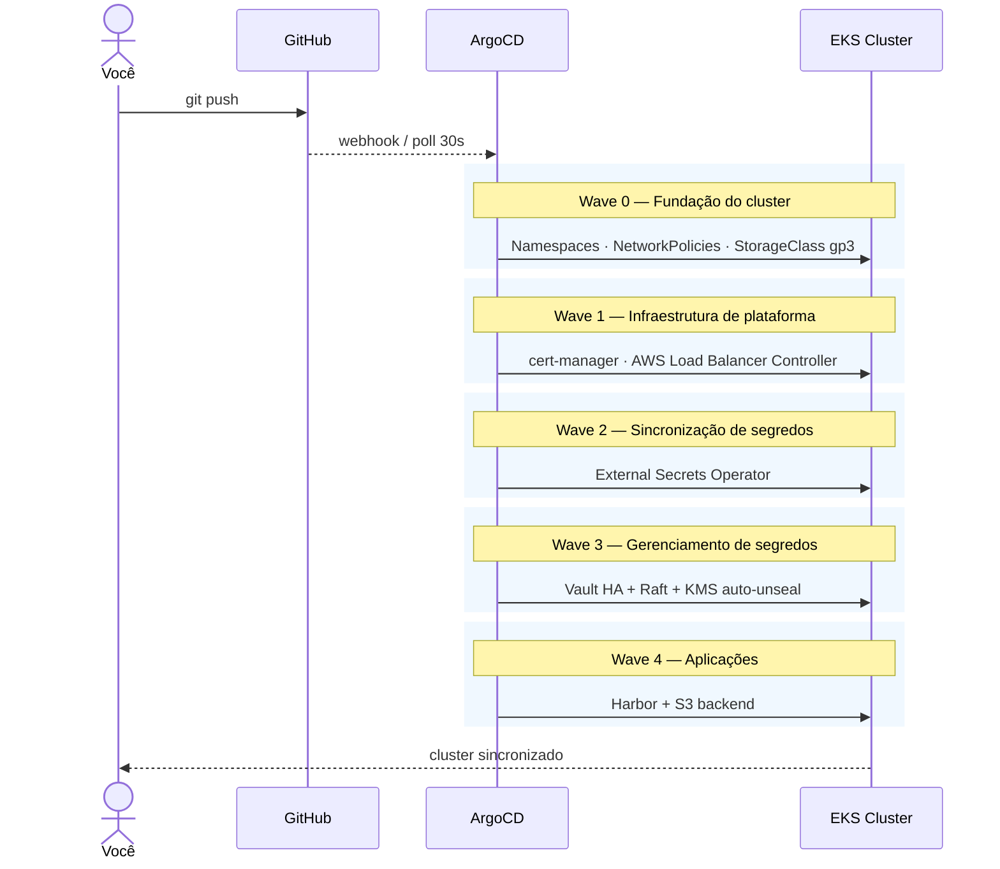

<div align="center">

<br/>

```
  ██████╗ ██╗████████╗ ██████╗ ██████╗ ███████╗
 ██╔════╝ ██║╚══██╔══╝██╔═══██╗██╔══██╗██╔════╝
 ██║  ███╗██║   ██║   ██║   ██║██████╔╝███████╗
 ██║   ██║██║   ██║   ██║   ██║██╔═══╝ ╚════██║
 ╚██████╔╝██║   ██║   ╚██████╔╝██║     ███████║
  ╚═════╝ ╚═╝   ╚═╝    ╚═════╝ ╚═╝     ╚══════╝
```

### infra-gitops-delivery-blueprint

**Cluster EKS production-grade, declarativo e pronto para usar**

<br/>

[](LICENSE)
[](https://aws.amazon.com/eks/)
[](https://argo-cd.readthedocs.io/)
[](https://developer.hashicorp.com/vault)
[](https://goharbor.io/)
[](https://github.com/RhuanCSG/infra-gitops-delivery-blueprint/pulls)

<br/>

> Um único `kubectl apply` arranca o cluster inteiro.  
> O ArgoCD cuida do resto — de forma contínua e declarativa.

<br/>

</div>

---

## Visão Geral

Este repositório contém os manifestos Kubernetes e valores Helm de um cluster EKS completo gerenciado por GitOps. Após o bootstrap inicial, qualquer mudança submetida via `git push` é automaticamente aplicada ao cluster pelo ArgoCD — nenhum acesso direto ao cluster necessário em operação normal.

O repositório foi projetado como **template**: faça fork, preencha seus valores e tenha um ambiente production-grade funcionando em minutos.

---

## O que é implantado

<table>
<thead>
<tr>
<th>Componente</th>
<th>Versão</th>
<th>Função</th>
<th>Padrão aplicado</th>
</tr>
</thead>
<tbody>
<tr>
<td><a href="https://cert-manager.io">cert-manager</a></td>
<td>v1.15.3</td>
<td>Certificados TLS via Let's Encrypt</td>
<td>ClusterIssuer ACME HTTP-01</td>
</tr>
<tr>
<td><a href="https://kubernetes-sigs.github.io/aws-load-balancer-controller/">AWS LBC</a></td>
<td>1.8.3</td>
<td>ALB automático a partir de Ingress</td>
<td>EKS Pod Identity</td>
</tr>
<tr>
<td><a href="https://external-secrets.io">External Secrets Operator</a></td>
<td>0.10.4</td>
<td>Vault → Kubernetes Secrets</td>
<td>ClusterSecretStore + Kubernetes auth</td>
</tr>
<tr>
<td><a href="https://developer.hashicorp.com/vault">HashiCorp Vault</a></td>
<td>0.28.1 (chart)</td>
<td>Gerenciamento centralizado de segredos</td>
<td>HA + Raft + KMS auto-unseal</td>
</tr>
<tr>
<td><a href="https://goharbor.io">Harbor</a></td>
<td>1.15.1 (chart)</td>
<td>Registry privado de imagens</td>
<td>Backend S3 + EKS Pod Identity</td>
</tr>
</tbody>
</table>

**Boas práticas aplicadas em todo o cluster:**

- ✅ EKS Pod Identity (padrão atual — sem IRSA)
- ✅ NetworkPolicies `default-deny` em todos os namespaces
- ✅ StorageClass `gp3` com criptografia por padrão
- ✅ Pods com `requests`/`limits` definidos
- ✅ Vault auto-unseal via KMS (essencial com Spot Instances)
- ✅ Sync waves para ordenação correta de dependências
- ✅ Amazon Linux 2023 e EBS `gp3` (sem recursos deprecados)

---

## Como funciona



---

## Pré-requisitos

> [!IMPORTANT]
> Este repositório **não cria** o cluster EKS nem instala o ArgoCD. Ele assume que você já tem ambos rodando. O guia completo de preparação está em [eks-gitops-blueprint](https://github.com/RhuanCSG/eks-gitops-blueprint).

**Recursos AWS necessários antes de começar:**

| Recurso | Finalidade |
|---|---|
| Cluster EKS 1.32+ com ArgoCD instalado | Pré-requisito principal |
| EKS Pod Identity Agent (addon) | Autenticação IAM para pods |
| Chave AWS KMS | Auto-unseal do Vault |
| Bucket S3 | Backend de imagens do Harbor |

**Ferramentas locais:**

```
git   aws-cli >= 2.x   kubectl >= 1.32
```

---

## Início Rápido

### 1 — Fork e clone

No GitHub, clique em **Fork** e depois:

```bash
git clone https://github.com/<SEU_USUARIO>/infra-gitops-delivery-blueprint
cd infra-gitops-delivery-blueprint
```

---

### 2 — Configure seus valores

<table>
<tr>
<td><b>Linux / macOS</b></td>
<td><b>Windows (PowerShell)</b></td>
</tr>
<tr>
<td>

```bash
cp scripts/config.env.example scripts/config.env
# edite scripts/config.env
```

</td>
<td>

```powershell
Copy-Item scripts\config.ps1.example scripts\config.ps1
# edite scripts\config.ps1
```

</td>
</tr>
</table>

Valores que você precisará preencher:

| Placeholder | Como obter |
|---|---|
| `<AWS_ACCOUNT_ID>` | `aws sts get-caller-identity --query Account --output text` |
| `<CLUSTER_NAME>` | Nome do seu cluster EKS |
| `<AWS_REGION>` | Região onde o cluster está (ex: `us-east-1`) |
| `<KMS_KEY_ARN>` | ARN da chave KMS criada para o Vault |
| `<HARBOR_S3_BUCKET>` | Nome do bucket S3 para o Harbor |
| `<GITHUB_USERNAME>` | Seu username no GitHub |
| `<HARBOR_ADMIN_PASSWORD>` | Gere com: `openssl rand -base64 24` |
| `<HARBOR_ALB_HOSTNAME>` | Hostname do ALB — preenchido após instalar o AWS LBC |

> [!TIP]
> `<HARBOR_ALB_HOSTNAME>` pode ficar para depois: instale tudo, obtenha o hostname do ALB e atualize o valor com um novo `git push`.

---

### 3 — Substitua os placeholders

<table>
<tr>
<td><b>Linux / macOS</b></td>
<td><b>Windows (PowerShell)</b></td>
</tr>
<tr>
<td>

```bash
bash scripts/replace-placeholders.sh
```

</td>
<td>

```powershell
.\scripts\replace-placeholders.ps1
```

</td>
</tr>
</table>

Verifique o resultado antes de continuar:

```bash
git diff
```

---

### 4 — Push para o seu repositório

```bash
git add .
git commit -m "chore: configure environment values"
git push origin main
```

> [!WARNING]
> Se o repositório for **público**, confirme que nenhum valor sensível foi commitado — senhas, IDs de conta ou ARNs de recursos. Prefira manter este repositório **privado** após preencher os valores.

---

### 5 — Bootstrap do cluster

Registre suas credenciais no ArgoCD (caso o repositório seja privado) e aplique a Application raiz:

```bash
kubectl apply -f bootstrap/root-app.yaml
```

O ArgoCD sincroniza todos os componentes automaticamente na ordem correta. Acompanhe em tempo real:

```bash
kubectl get applications -n argocd -w
```

---

## Configuração pós-sync

Três componentes precisam de passos manuais após o ArgoCD sincronizar, pois envolvem estado gerado em runtime:

<details>
<summary><b>Vault — inicialização obrigatória</b></summary>

```bash
# Inicializar (feito uma única vez)
kubectl exec -n vault vault-0 -- vault operator init \
  -key-shares=1 -key-threshold=1 -format=json > vault-init.json

# Salvar o root token em local seguro (gerenciador de senhas)
cat vault-init.json | jq -r '.root_token'
```

Após inicializar, configure o Kubernetes auth method e as políticas de acesso para o External Secrets Operator. Instruções detalhadas: [guia do Vault](https://github.com/RhuanCSG/eks-gitops-blueprint/blob/main/docs/05-vault.md).

</details>

<details>
<summary><b>Harbor — projeto e robot account</b></summary>

1. Acesse a UI do Harbor e troque a senha padrão do admin
2. Crie o projeto de imagens (ex: `gitops-lab`) com escaneamento automático habilitado
3. Crie um robot account com permissão de `pull` nesse projeto
4. Armazene as credenciais no Vault:

```bash
kubectl exec -n vault vault-0 -- vault kv put secret/harbor/robot-account \
  username="robot\$eks-cluster-pull" \
  password="<SECRET_DO_ROBOT>" \
  server="<HARBOR_ALB_HOSTNAME>"
```

</details>

<details>
<summary><b>cert-manager — ClusterIssuers</b></summary>

Substitua `<SEU_EMAIL>` nos ClusterIssuers em `manifests/` e aplique:

```bash
# Sempre comece com staging para validar sem atingir rate limits
kubectl apply -f manifests/cluster-issuers.yaml
kubectl get clusterissuer
```

Quando `letsencrypt-staging` estiver `Ready=True`, troque para `letsencrypt-prod`.

</details>

---

## Estrutura do repositório

<details>
<summary>Expandir</summary>

```
infra-gitops-delivery-blueprint/
│
├── bootstrap/
│   └── root-app.yaml                       # Application raiz — aplicar uma única vez
│
├── apps/                                   # ArgoCD Applications (gerenciadas pelo root-app)
│   ├── cluster-manifests.yaml              # sync-wave: 0
│   ├── cert-manager.yaml                   # sync-wave: 1
│   ├── aws-load-balancer-controller.yaml   # sync-wave: 1
│   ├── external-secrets.yaml               # sync-wave: 2
│   ├── vault.yaml                          # sync-wave: 3
│   └── harbor.yaml                         # sync-wave: 4
│
├── charts/                                 # Helm values por ferramenta
│   ├── cert-manager/values.yaml
│   ├── aws-load-balancer-controller/values.yaml
│   ├── external-secrets/values.yaml
│   ├── vault/values.yaml                   # inclui config KMS e Raft
│   └── harbor/values.yaml                  # inclui config S3
│
├── manifests/                              # Recursos Kubernetes puros (não-Helm)
│   ├── namespaces.yaml
│   ├── storageclass.yaml                   # gp3 como padrão
│   └── network-policies/                   # default-deny + allow explícito
│       ├── argocd-netpol.yaml
│       ├── cert-manager-netpol.yaml
│       ├── external-secrets-netpol.yaml
│       ├── vault-netpol.yaml
│       └── harbor-netpol.yaml
│
└── scripts/
    ├── config.env.example                  # Template de valores (Linux / macOS)
    ├── config.ps1.example                  # Template de valores (Windows)
    ├── replace-placeholders.sh             # Script de substituição (Linux / macOS)
    └── replace-placeholders.ps1            # Script de substituição (Windows)
```

</details>

---

## Documentação completa

O guia passo a passo — incluindo criação da VPC, cluster EKS, configuração de cada ferramenta e troubleshooting — está em:

**[eks-gitops-blueprint →](https://github.com/RhuanCSG/eks-gitops-blueprint)**

---

<div align="center">

Feito com foco em qualidade e boas práticas de produção.

[](https://github.com/RhuanCSG/eks-gitops-blueprint)
&nbsp;
[](LICENSE)

</div>
